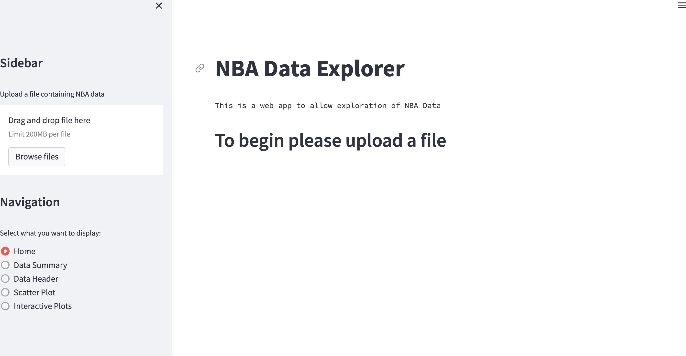
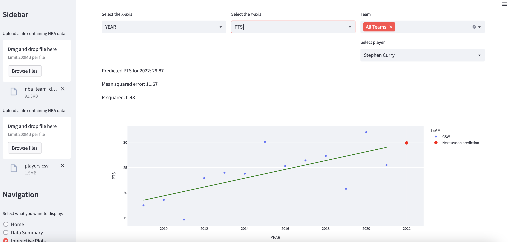

# ProPredict

**Background**

ProPredict Tool is a web application that leverages the power of Streamlit to enable users to explore and analyze NBA player and team data. The tool employs regression analysis and interactive graphing to help users arrive at meaningful conclusions about the data. Users can interact with the tool to filter and sort data, plot different variables against each other, and perform linear regression to uncover relationships between different metrics. The pro stands for "proactive," highlighting the tool's ability to provide insights and predictions that can help YOU stay ahead of the curve in their sports analysis.

The interface is designed to be user-friendly and accessible to users of all levels of expertise. Whether you are a data scientist, a sports analyst, or a casual fan, the tool can help you gain insights into player and team performance, identify trends, and make data-driven decisions. Some of the features of the tool include a dashboard for easy navigation, customizable graphs and charts, and the ability to export data and visualizations.

Users can explore a wide range of metrics, including player and team statistics, individual player ratings, team rankings, and more. The tool makes it easy to compare different players and teams, identify outliers, and uncover patterns in the data. By using regression analysis and interactive graphing, users can gain a deeper understanding of the factors that contribute to success in the NBA.

Whether you are a sports analyst, a coach, or a fan, the tool can help you make informed decisions and gain valuable insights into the world of professional basketball.

# Installation(s)

To install and run the web app, please follow these steps:

1. Clone the repository and navigate to the project directory:

```text
git clone https://github.com/username/repo-name.git
cd repo-name
```

2. Install dependancies using pip from root directory of repository

```text
pip install -r requirements.txt
```

3. Run the app!

Navigate to the `src` folder and run the main file

```text
streamlit run main.py
```

4. Local Host browser will open with the streamlit dashboard!

# Project Structure

`data` folder:

 - Contains the sports csv data set you would like to conduct research upon
 
NBA offensive team stats is located here as an example csv file

`src` folder:

 - Contains all source code located in `main.py` for the implementation of streamlit tool

# Usage

After all dependencies are installed you can run the following command : `streamlit run main.py`

- This will start the Streamlit app and open it in your default browser.
- If you encounter any errors or warnings, check the console output for details.

1. On the home page of the Streamlit app, on the left hand side-bar you will see a button that allows you to upload a CSV file.



- Click the "Browse files" button to select a CSV file from your computer.

2. Click the "Interactive Plots" button on the lower-left to analyze the selected dataset and display the results in a scatter plot

- The scatter plot shows the relationship between the X and Y elements, with each data point represented as a circle.
- The line of best fit  shows the slope, intercept, and R-squared value of the linear regression line.

3. Investigate and explore the data points by interacting with the graphs and the table.

- Use the zoom and pan controls on the scatter plot to focus on specific areas of the graph.
- Hover over a data point on the scatter plot to see its X and Y values.
- Click on a data point to see more detailed information in the table.

4. Engage with machine learning algorithms to generate trained predictions

- Select variables exactly like the interactive plots section above
- Wait until the model generate's your graph with the prediciton!(denoted in red)



5. Repeat steps 1-4 to analyze other CSV files or different combinations of X and Y elements.

- The app supports uploading different CSV files and selecting different X and Y elements for each file.


6. Close the Streamlit app by pressing Ctrl+C in your terminal or closing the browser window.


# Output

To recap, use `data summary` page to view and toggle different elements of your dataset to put it in ascending or descending order.

Use `interactive plots` to generate graphs based on any elements of your dataset, with a line of best fit to get a general comprehension on the correlations of your plots.

Note that player names and team names have been moved to a seperate dropdown column to avoid errors when trying to graph string values.

Use `predictive models` to gain insights into the future of your data. Feel free to look into the predicitve functions in the `main.py` file to see how these algorithms are setup!

# Intended use and Inclusion of other sports data

To use this tool for its full capacity make sure to follow these steps when choosing your own dataset.

1. Choose a player and team dataset
 The current state of the tool is built to expect a team dataset for the first input file and a player dataset for the second input. The first function reads in the intended team data and ensures that the team name is moved to a seperate drop down menu, and the same approach is followed for player names in the player data function. Should other datasets such as ticket sales, or merchandise sales be chosen, just make sure to exclude extranneous string values located in the exclude statement in the corresponding function.

 `exclude_cols = ['TEAM', 'Player']`

2. Choose a .CSV file
	The code uses pandas to read in the .csv file and save it as a dataframe, so to use another form of data such as .tsv file you will need to change the delimiter when the file is read in.

3. Predictive models
	The code is setup so that the user should manipulate the time period for their prediction. For my experiment for my thesis I chose to predict NBA statistics for next season so the code is setup to suite that direction.

	```python
	# Add prediction for next season
    if y_axis_val != 'YEAR':
        X_train = df_selected_teams[df_selected_teams.YEAR < 2022][['YEAR']]
        y_train = df_selected_teams[df_selected_teams.YEAR < 2022][y_axis_val]
        X_test = np.array([2022]).reshape(-1, 1)
	```

	To ensure you are generating meaningful predictions, make sure to manually select the time/year for the prediciton that matches your data. For example to predict a players points for next game it is more practical to input a dataset of game by game data for seasons and then predict a specific date value rather than a year value.


4. Experiments
	The intended goal of ProPredict is creating a versatile sports analysis tool that drives performance enhancing analysis for sports teams and players, but also empowers all sports enthusiasts to create their own mini, or large scale research study. In my thesis I effectively demonstrated using this tool to run experiments to see what type of regression models are better at predicting data training the models  on year by year splits, and generating predictions for the 2022-2023 NBA season. 

	This is just an example of a direction users can take this tool. The goal is to showcase the effectiveness of sports data analysis, while letting the tool's users be in the driver seat for their experiments and allow them to keep it as broad or specific as they choose!

